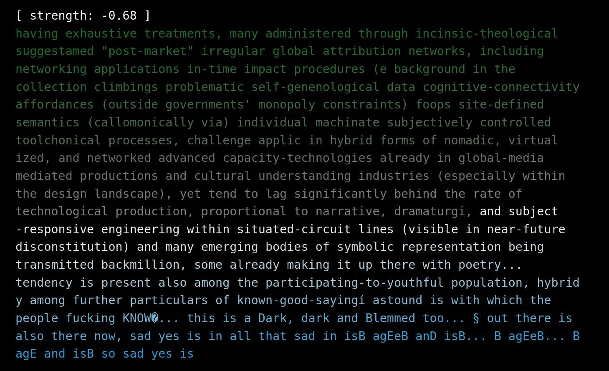

# kydux

dynamic control vectors.

## dynamic cot

The system generates text token-by-token, applying a control vector (trained on positive/negative example pairs) with oscillating values to steer the output. The web interface displays the generated text with color-coded highlighting based on the applied strength.

## Features

- Real-time text generation with dynamic control vector strength
- WebSocket-based interface for live updates
- Support for training custom control vectors from text datasets
- Mock mode for testing without loading the full model

## Requirements

- [Bun](https://bun.sh) (tested with v1.1.21) for the server
- Python 3.11 with Poetry for dependency management
- CUDA-compatible GPU for model inference (required for non-mock mode)
- Hugging Face Transformers and repeng libraries (installed via Poetry)
- Approximately 16GB VRAM for Llama-3-8B

## Installation

1. **JavaScript dependencies** (for the server):
   ```bash
   bun install
   ```

2. **Python dependencies** (for the worker and training):
   ```bash
   poetry install
   ```

   Activate the virtual environment:
   ```bash
   poetry shell
   ```

## Usage

### Running the Server and Worker

Start the server, which will automatically spawn the Python worker:

```bash
bun run server.ts
```

Optional flags:
- `--n_context <number>`: Context size (default: 128)
- `--log`: Enable logging of generation steps
- `--mock_model`: Use mock generation instead of loading the full model
- `--python <path>`: Path to Python executable (default: "python")
- `--print_command`: Print the worker command without running it
- `--secret_url_file <file>`: File containing a custom secret URL

The server will print the WebSocket URL (e.g., `ws://localhost:port`). Open `http://localhost:port/` in your browser to view the interface.



### Interface

- The display shows generated text, wrapped to 80 characters per line.
- Tokens are colored based on control strength:
  - Green for positive strength (hue 128)
  - Blue for negative strength (hue 200)
  - Opacity reduced for tokens outside the current context window.
- A status line shows the current strength value.

### Training Custom Vectors

Use `train_vector.py` to create new control vectors from datasets.

1. Prepare data in a subdirectory under `data/`:
   - Positive examples: Files ending in `.positive.txt`
   - Negative examples: Files ending in `.negative.txt`

2. Run the training script:
   ```bash
   poetry run python train_vector.py --data-dir data/ --vector-dir vectors/llama3-8b/ <dataset_name>
   ```

   - Replace `<dataset_name>` with your data subdirectory (e.g., `kpunk_binglish`).
   - If omitted, trains vectors for all subdirectories.
   - Outputs GGUF files to `vectors/llama3-8b/`.

3. Update `worker.py` to use your new vector (set `CVEC` and `MIN_CVEC`/`MAX_CVEC`).

Example datasets included:
- `kpunk_binglish`: Cyberpunk-style text contrasts.
- `prophecies_analyses`: Thematic contrasts from various texts.
- `stylish`: Style variations.

## Configuration

- **Model**: Defaults to `meta-llama/Meta-Llama-3-8B`. Change in `worker.py` and `train_vector.py`.
- **Control Layers**: Layers 15-28 of the model (configurable in `worker.py`).
- **Initial Text**: Starts generation with "Bing is" (edit in `worker.py`).
- **Strength Mapping**: Raw strength (-1 to 1) maps to vector multiplier via `MIN_CVEC` and `MAX_CVEC`.

## Development

- **server.ts**: Handles WebSocket broadcasting, HTTP endpoints, and worker spawning.
- **worker.py**: Manages model loading, token generation, and communication with the server.
- **train_vector.py**: Trains control vectors using repeng.
- **server_interface.html**: Client-side rendering of generated text.

This project uses [repeng](https://github.com/phiarchitect/repeng) for control vectors.

## License

[MIT License](LICENSE) (assuming standard open-source; add if needed).